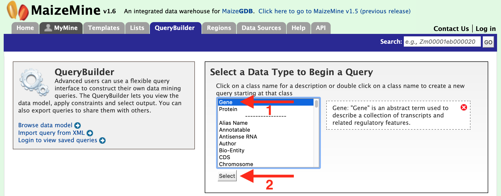
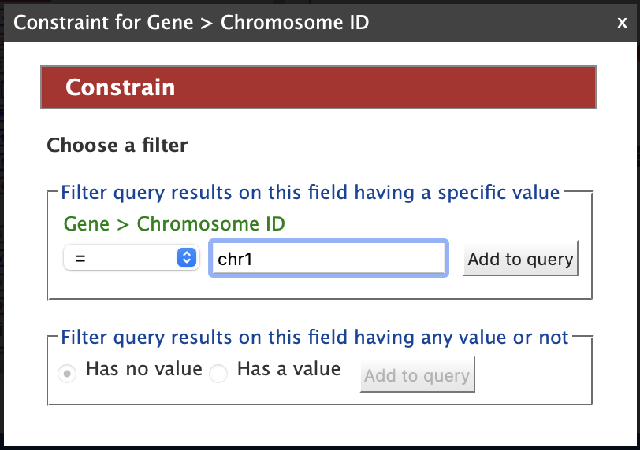
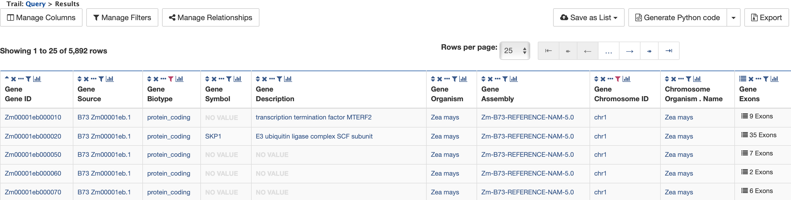
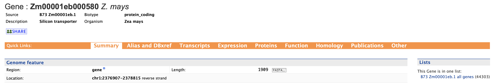
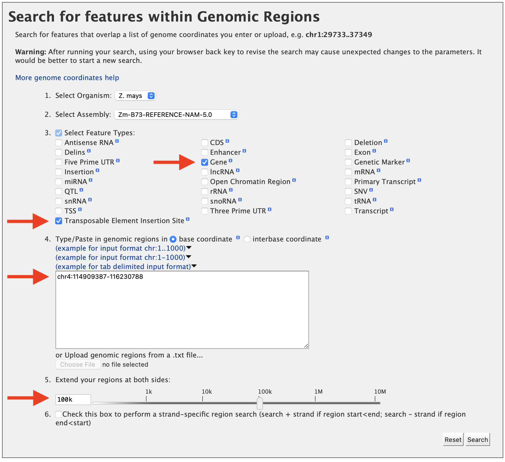
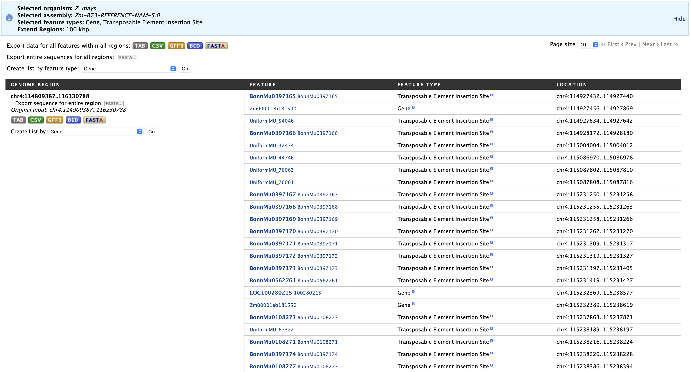
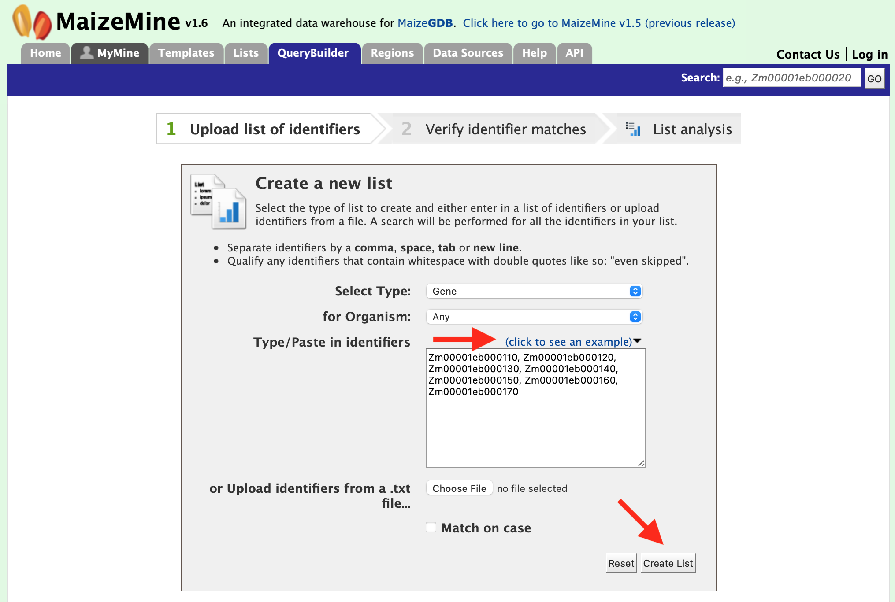
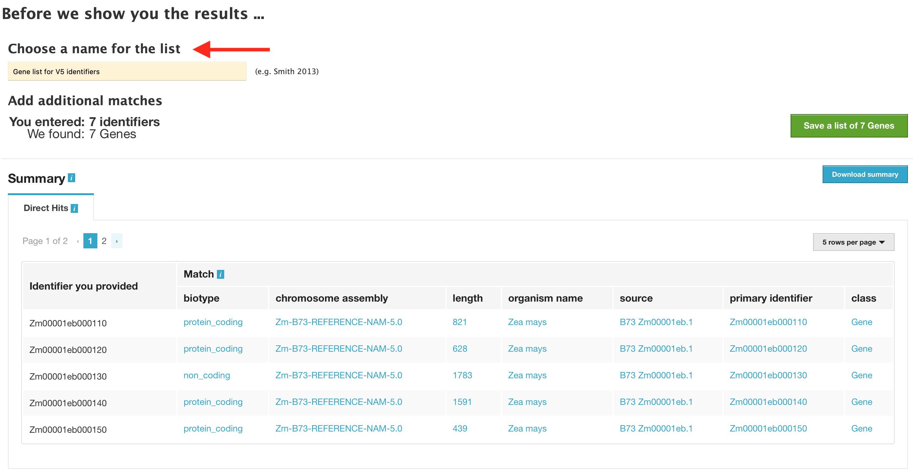

  

# Welcome to MaizeMine 

MaizeMine is powered by InterMine and provides a user-friendly way to access genomic, proteomic, interaction and literature data for the important crop plant *Zea mays*. MaizeMine is a part of the [Maize Genetics and Genomics Database](www.MaizeGDB.org) which is supported by the USDA-ARS.  This tutorial is focused on giving users an introduction to the different parts of MaizeMine and how users can fully leverage MaizeMine.  The latest MaizeMine release supports the Zm-B73-REFERENCE-NAM-5.0 genome assembly of the maize B73 reference genome and the Zm00001eb.1 and RefSeq gene sets.  We anticipate adding additional updated B73 assemblies as they become available.
> Link to the MaizeMine Homepage: http://maizemine.maizegdb.org 
> 

## Overview of MaizeMine

Before going into details, please work through this brief summary about the layout of MaizeMine.

_Home_ – The home page for MaizeMine.

_Templates_ – Shows the lists of templates that users can use based on the nature of their query.

_Lists_ – Takes the user to a list page where they can upload their list of genes and perform enrichment analyses. Users, once logged into MyMine, can also save their lists for future use.

_QueryBuilder_ – a page where users can build custom queries by browsing the MaizeMine data model and customize their results. Users can also download the created query as XML.

_Regions_ – a Genomic Region Search page where users can enter genomic coordinates and retrieve features that fall within the interval. Users can also extend the interval via a slider bar, to increase the range of search.

_Data sources_ – a page where all data sources, their links and the date of download is specified in a tabulated format.

_Help_- a page for guidance, when working through MaizeMine. 

_API_ – a page where users can discover more about the InterMine API to programmatically access MaizeMine.

_MyMine_ – allows users the option of setting up a password protected, account in MaizeMine.  Once users are logged in, MyMine serves as portal for accessing saved lists and templates. Users can also manage their account information using MyMine.

## **Searching in MaizeMine**

There are several different ways for users to query MaizeMine.

**Quick Search**

The ‘Quick Search’ enables users to search keywords from any of the datasets in MaizeMine. The Quick Search box is on the main page and on the upper-right hand corner of each page.  Users can input their gene name, gene identifiers or keywords and search MaizeMine. The wildcard character ‘*’ can be used to get all results that matches the query. As an example, enter ‘GR2b’ in the search box and click ‘Search’.

The results page is tabulated below and shows a summary of the query.

The results may be filtered based on ‘Category’ or ‘Organism’ (red box). The score column in the result table indicates the similarity of the query to the result fetched by MaizeMine.

The results page can also be converted to a list. To enable this feature click on ‘Gene’ in ‘Hits by Category’ section marked with a red box.

This will filter the results for the feature type ‘Gene’ and checkboxes will be available for users to select genes they would like to add to their list. Note the red arrow, which denotes that the category has been restricted to the “Gene” search results.  Once the genes are selected, click on “CREATE LIST” denoted by the red box. List features will be described later.

**Templates**

In addition to the Quick Search box, users can make use of templates which are pre-constructed queries developed using the “QueryBuilder” which will be covered later.  Templates can be accessed by clicking on the “Templates” menu tab or by accessing the “popular templates” section near the bottom of the page where templates are organized by type.  The Templates page provides a list of templates that users may choose from based on the nature of their query.  Below are two examples using the Templates feature of MaizeMine.  

**1. Retrieving Gene Expression Values for a Gene**
To utilize this template, which is shown in the figure below, users only need to enter the gene model name (DB identifier) for their gene of interest and click the “Show Results” button.  In addition to information on gene expression, detailed information will be returned on the sample growth stage, organ group, and plant ontology (PO) terms.

The result page returns gene expression values in FPKP for 91 tissues. The layout of the results table may be customized by clicking on ‘Manage Columns’ (Box 1). Users may generate the code for the query in Perl, Python, Java, Ruby, JavaScript or XML (Box 2). The search results can be downloaded by clicking on “Export” (Box 3). The format options for the results download file are tab-separated (.tsv), comma-separated values (.csv), XML, or JSON.  Additionally, if the results are genomic features, then the results can be downloaded in GFF3 and BED format as well.

**2.  Retrieving Gene Ontology (GO) Terms for a Gene**
Given a maize gene symbol or gene ID, Gene Ontology terms can be obtained using the “Gene to GO Terms” template.  The gene id Zm00001eb105010 is pre-filled in the text box as an example.  It is worth noting that any template may be edited using the “Edit Query” feature (red box) that allows customization of a template to meet specific user needs.  As users gain experience with the QueryBuilder, modifying a preexisting template may be a good alternative to building a query de novo.

After clicking "Show Results", a table is delivered below with the GO term identifiers, names, and descriptions.  Using the “Manage Columns” feature (red box #1), it is possible to re-arrange, remove, or even add columns to the table.  Using the “Manage Filters” button (red box #2) it is possible to edit of remove active filters and change the constraint logic applied within a template.  Each column in a table may be sorted, removed, or hidden.  Particularly useful is the “view column summary” feature represented by the small bar graph icon (red box #3).  Clicking on this icon allows viewing of the number, name, and counts of the types of entries within a column.

## **Query Builder**

While the templates provided are suitable for many different types of searches, new queries may be built from scratch using the QueryBuilder. The possibilities of queries using the QueryBuilder are endless. The query constraints may be customized to perform complex search operations, and the output can be formatted as desired.

Three scenarios for using the QueryBuilder are described below.

Each example begins by selecting “Gene” as the Data Type (red arrow #1) in the QueryBuilder start page as shown in the figure below. 

After clicking ‘Select’ (red arrow #2), the Model browser appears as shown below, displaying the attributes for the selected feature class “Gene”.

**Example 1.  Querying for protein-coding genes in Zm00001eb.1**

In this example, the results are restricted to protein genes in the Zm00001eb.1 gene set.  Recall that there are two gene model sets for *Zea mays* in MaizeMine v1.4: Zm00001eb.1 and the latest release from RefSeq.  First click on the “Summary” tab for “Gene” in the Model Browser shown in the left panel of the figure above and then the “Constrain” tab (to right of “Summary”).  A “Constraint for Gene” box pops up as shown in the figure below. Check the box next to “Contained in list:” and select Zm00001eb.1 Genes from the dropdown.

 

Then click “Add to query”. Note that the “Query Overview” section has been updated to reflect the selected attributes and query constraint. The “Summary” tab for Genes automatically adds the Gene attributes DB Identifier, Source, Biotype, Symbol, and Name, along with the Organism name and Chromosome assembly linked to the genes. At the top of the Query Overview , “IN Zea mays all Zm00001eb.1 genes” appears just below “Gene” as a constraint for this query. Next click on the “Constrain” tab for “Biotype” and select “protein_coding” from the dropdown as shown in the figure below. 

Constraining the query to “protein_coding” filters the results to only high quality protein-coding gene models from Zm00001eb.1.  Click on “Add to query”.  The Model Browser should resemble the image below.

Finally, clicking on “Show results” returns a table of 39,756 genes that have the status “protein_coding” as shown below:

Since there are no values in the Symbol or Name columns, these may be removed from the results table by clicking on the **&#215;** icon above the columns. The table then appears as shown below.

**Example 2. Querying for protein-coding genes on a particular chromosome** 

This next example builds on the above query by adding another constraint to limit the search to protein-coding genes on a specific chromosome as shown in the figure below.

Note that when viewing the results table, it is possible to return to the Query Builder for that query by clicking the Query link just above the table (red arrow in figure below). This allows users to easily modify their queries without having to repeat the steps of setting up the query each time.

Back in the Query Builder interface, begin by clicking the &#x002B; (plus sign) next to “Chromosome” to expand the Chromosome feature class (red arrow #1) and then select “summary” (red arrow #2).  Be sure to use the “Chromosome” feature class and not the “Chromosome Location” feature class that is located lower on the model browser.  

Next, click “Constrain” next to the “DB identifier” attribute (red arrow #3). In the constraint pop up box, select “=” from the drop-down and enter “chr1” into the text field; then click “Add to Query”. 

The Query Overview in the panel on the right side should resemble the one in the box below.

It is also possible to restrict the query to a subset of coordinates on chr1. In this situation, the “Chromosome Location” feature class would be expanded to reveal the attributes “Start Integers” and “End Integers”, and the desired coordinates would be entered after clicking the “Constrain” tab next to each attribute (similar to the previous step of constraining the chromosome identifier). It is worth noting that there might be easier ways to do this using the “Genomic Regions Search”, which will be described later.

Clicking “Show Results” returns a table of 5,892 protein-coding genes on chromosome 1 as shown below.

**3. Example 3: Querying for exon information in protein-coding genes** 

The above results may be customized even further by configuring the query to show all of the exons and their lengths for each Gene as shown in the figure below.  Expand the “Exon” feature class (red arrow #1) and select “Show” next to the “DB identifier” and “Length” attributes (red arrows #2 and #3).

To make the output more visually pleasing, click on the blue square to the right of the Exon collection in the Query Overview panel (red arrow #4) and the popup shown below will appear.

Select “Show all Genes and show Exons if they are present” and click on “Add to query”.  This will group all of the exons together for each Gene in the results table (rather than displaying one exon per row). Now run the query to view the table of results as shown below.

There are 5,892 genes on Chromosome 1 and the Zm00001eb000010 gene model has nine exons. Click on the “9 exons” text to expand the table with additional rows describing the length and DB identifier for each of the nine exons as shown in the figure below.

## **Report Page**

Every class (e.g., Gene, Protein, Exon) in MaizeMine has a report page; the layout of the report page depends on the data available for a given query. There are several ways to access a report page for a class: one method is to click on an the blue links in the results table after running or query, another is to simply search for an identifier using the Quick Search as described above and click on one of the search results.

Using the example of “Zm00001eb000580”, the report and summary section for this gene is shown below.

The report page provides a complete description for gene Zm00001eb000580. The DB identifier and organism name are displayed in the header. The “Biotype” indicates the type of gene, in this case a protein-coding gene. Other possible values are:

· non_coding – non-coding gene

· lncRNA – long non-coding RNAs

· miRNA – micro RNAs

· rRNA – ribosomal RNAs

· snRNA - small nuclear RNAs

· snoRNA - small nucleolar RNAs

· tRNA – transfer RNAs

· misc_RNA - miscellaneous RNA

· antisense_RNA - antisense RNAs

**Summary:**

The Summary section of the report page provides a summary about the gene such as length, chromosome location, and strand information. Users can also download the complete FASTA sequence of the gene by clicking on the FASTA tab.

**Alias and DBxref:**

The Alias and DBxref section provides aliases (if any) and cross references to other gene model sets or assemblies.  The current release of MaizeMine has gene models for the latest B73 assembly and the latest RefSeq gene models.

**Transcript:**

This section, shown in the figure below, provides information about the gene model. The first table displays all of the transcripts and exons for a gene. The FASTA sequence of each transcript or exon (red arrows) can be downloaded by clicking on the FASTA tab. The coding sequences for a transcript can also be downloaded, when available, by similarly clicking on the FASTA tab in the Coding Sequences column. The second table displays Polypeptides for the gene (if any).

**Gene Expression:**

The Gene Expression section provides RNA-SEQ mean based expression data for 91 tissues in FPKM expression values.

**Protein:**

The Protein section provides information about the protein product of gene.

**Function:**

The function section provides information on Gene Ontology (GO, red arrow #1) and pathway information (red arrow #2).  GO information is divided into three categories: 1) Cellular Component, 2) Molecular Function, and 3) Biological Process. GO terms are displayed along with the evidence code indicating how the annotations were derived.  Pathway information (if available) provides information on what metabolic pathways are involved including pathway identifiers, common pathway names, and the information source.

**Homology and Publications**

The homology and publications sections provide information on transcript homologs in other species and from which dataset the information is derived and publications referencing the gene.

## **Genomic Regions Search**

The Genomic Regions Search, shown in the figure below, is a tool to fetch features that are within a given set of genomic coordinates or to retrieve features that are within a given number of bases flanking a given set of genomic coordinates. Currently, the Regions Search tool supports the V5 assembly.

The coordinates must be of the format:

chr#:start..end (e.g. chr3:114909387..117230788 or chr3:114,909,387..117,230,788)

OR

chr#:start-end (e.g. chr3:114909387-117230788 or chr3:114,909,387-117,230,788)

Click on one of the “example for input format” links for a representative set of genomic coordinates in that format.  It is also possible to upload a file with a list of coordinates.

The Genomic Regions Search page in MaizeMine supports a wide variety of genomic feature types.  Since some of the features (e.g., SNPs) are very common in the genome, searching for these features within a large genomic region(s) can take a long time to run the query.  In these cases, it is advised to keep genomic search intervals as small as possible to accomplish the search.  Users can initiate the search process by choosing the features of interest and entering a set of coordinates in one of the accepted formats.  Optionally, the regions on either side of the genomic coordinates may be extended using the slider or by entering the amount manually using the text box.  This is a useful feature, as many times the genomic search interval is approximate (e.g., genetic mapping) and a margin of error is needed.  Users may also select the type of coordinate system they would like to use: base coordinate or interbase coordinate.

Suppose, as an example, a user has mapped a mutation in leaf angle to ~1.3 M region on Chromosome 4 (chr4:114909387-116230788) using high density molecular markers.  The user wants to know how many genes might be in this 1.3 M region and what mutant stocks or transposable element insertion sites might be available to test each of these genes for a similar mutation in leaf angle. Begin by checking the desired feature types and entering the coordinates as shown in the figure below. Using the slider or text box, extend the region by 100 kb on either side to give the molecular mapping results a little leeway just in case.

The results page for the Genomic Regions search gives a list of features that are present in the genomic interval provided in the input.  The results can be exported as tab-separated or comma-separated values. If the results have genomic features, then they can also be exported in GFF3 or BED format. The FASTA sequences of the features can also be downloaded.

To create a list of particular features from the result page, filter based on feature type (shown in the red box in the above figure) and click “Go”.

## **Lists**

Users may create and save lists of features, such as gene IDs, transcript IDs, gene symbols, etc. The list tool searches the database and will attempt to convert the identifiers to the type selected in the list “Select Type” option.

Click on the “Click to see an example” text to load the example list of gene models into the search box and then click on “Create List”.

The list tool performs a lookup of the identifiers and retrieves the results. If there are any duplicates, which there are not in this case, users can decide to add the relevant entries individually. Before displaying the results, users are prompted to enter a name for this new list (see figure below).  

Be sure to chose a name that accurately describes the contents of the new list, as over time a large number of lists may be accumulated in the “My Mine” section, and an accurate and detailed name prevents confusion when trying to retrieve lists for additional analysis.

Once the list has been named, click on the green “Save a List of 7 genes” button. A “List Analysis” page is presented that contains widgets (listed below) allowing users to perform analyses on the genes in the list that they have created.

**Available widgets**

Before using any of the widgets, please read the notes under “Important Notes for Enrichment Widgets to avoid false positives.”

1. Gene Ontology Enrichment
2. Publication Enrichment
3. Pathway Enrichment

## **MyMine**

MyMine serves as a password-protected portal for users to manage their lists, queries, templates, and account details.  It is strongly suggested that MaizeMine users establish a MyMine account as this allows them to save lists from session to session.  Without a MyMine account, MaizeMine deletes lists after each session.

1. Lists – lists saved by the user.
2. History – a list of most recent queries performed by the user.
3. Queries - all queries saved by the user
4. Templates – templates created by the user or existing templates that are marked as “favorite” by the user.
5. Password change – password management for the user’s account.
6. Account Details - account information and personal preferences.

## **API**

An API is available for users who would like to programmatically access MaizeMine.  Perl, Python, Ruby, and Java are the languages supported by the InterMine API.  For more information on the details of the API visit the [Intermine website](http://intermine.org/)

## **Data Sources**

The Data Sources page provides a description of the datasets that are integrated into MaizeMine along with their date of download, version or release, citations wherever applicable, and any additional comments.

----------

© Copyright 2021, Jack Gardiner, Justin Le Tourneau, Md Shamimuzzaman, Aditi Tayal, Deepak Unni, Colin Diesh, Chris Elsik, Darren Hagen.
