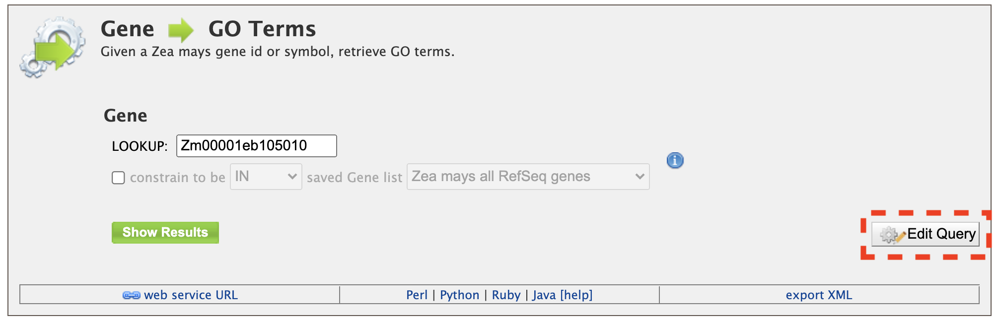
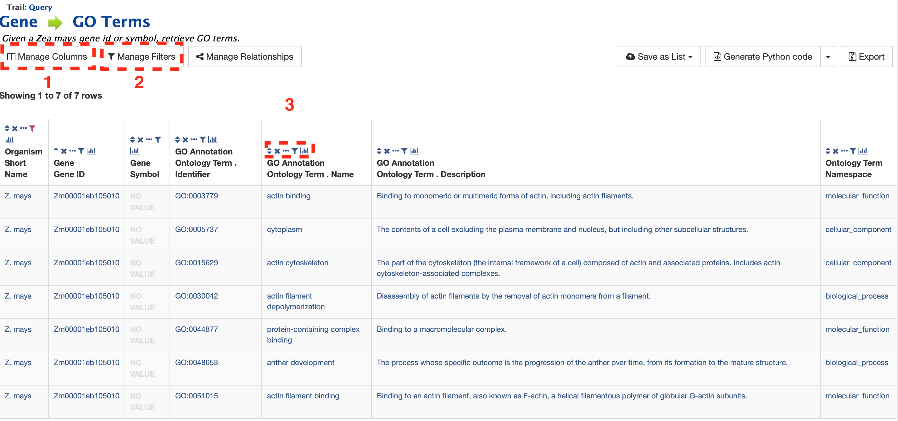
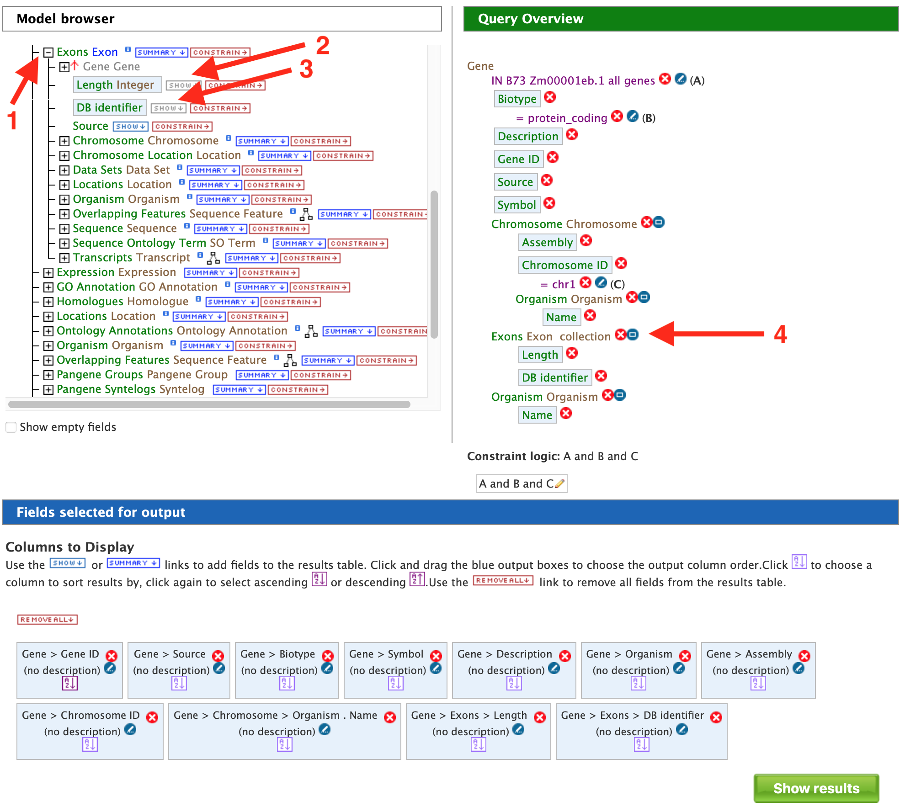
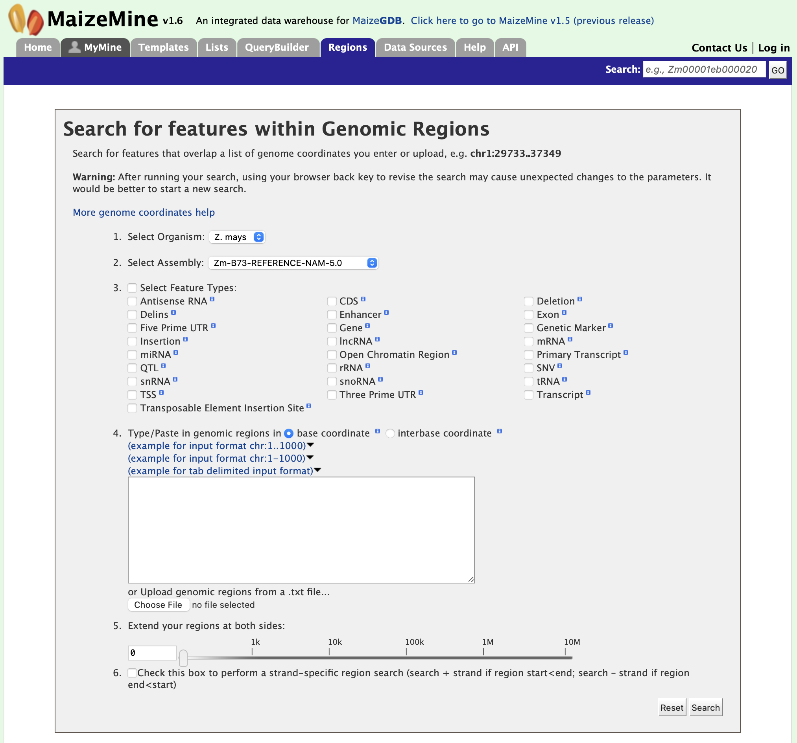
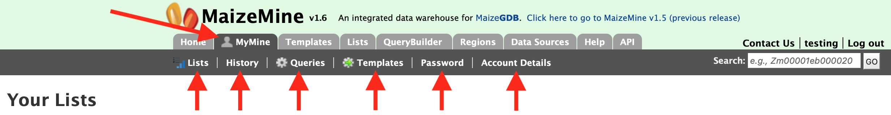
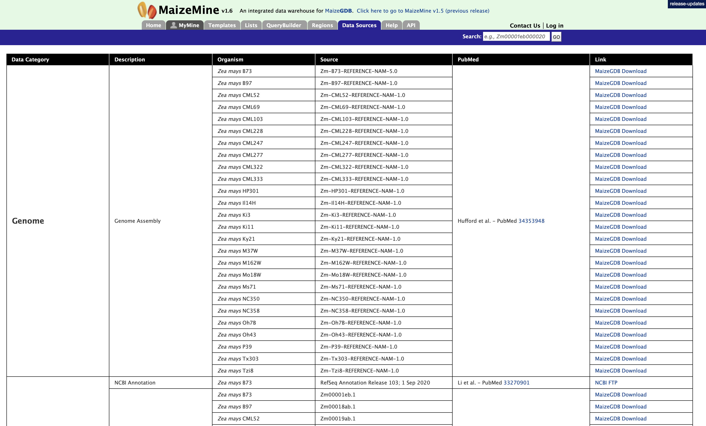

  

# Welcome to MaizeMine 

MaizeMine is powered by InterMine and provides a user-friendly way to access genomic, proteomic, interaction and literature data for the important crop plant *Zea mays*. MaizeMine is a part of the [Maize Genetics and Genomics Database](www.MaizeGDB.org) which is supported by the USDA-ARS.  This tutorial is focused on giving users an introduction to the different parts of MaizeMine and how users can fully leverage MaizeMine.  Currently, MaizeMine supports two versions (AGPv3 and AGPv4) of the maize B73 reference genome and the AGPv3.21, AGPv4 and RefSeq gene sets.  We anticipate adding additional updated B73 assemblies as they become available.
> Link to the MaizeMine Homepage: http://maizemine.maizegdb.org 
> 

## Overview of MaizeMine

Before going into details, please work through this brief summary about the layout of MaizeMine.

_Home_ – The home page for MaizeMine.

_Templates_ – Shows the lists of templates that users can use based on the nature of their query.

_Lists_ – Takes the user to a list page where they can upload their list of genes and perform enrichment analyses. Users, once logged into MyMine, can also save their lists for future use.

_QueryBuilder_ – a page where users can build custom queries by browsing the MaizeMine data model and customize their results. Users can also download the created query as XML.

_Regions_ – a Genomic Region Search page where users can enter genomic coordinates and retrieve features that fall within the interval. Users can also extend the interval via a slider bar, to increase the range of search.

_Data sources_ – a page where all data sources, their links and the date of download is specified in a tabulated format.

__Help_- a page for guidance, when working through MaizeMine. _API_ – a page where users can discover more about the InterMine API to programmatically access MaizeMine.

_MyMine_ – allows users the option of setting up a password protected, account in MaizeMine.  Once users are logged in, MyMine serves as portal for accessing saved lists and templates. Users can also manage their account information using MyMine.

## **Searching in MaizeMine**

There are several different ways for users to query MaizeMine.

**Quick-Search**

The ‘Quick-search’ enables users to search keywords from any of the datasets on MaizeMine. The quick-search box is on the main page and on the upper-right hand corner of each page.  Users can input their gene name, gene identifiers or keywords and search MaizeMine. Users can make use of wildcard character ‘*’ to get all results that matches their query.  Let us consider gene ‘bz1’ as an example. Enter ‘bz1’ in the search box and click ‘Search’.

The results page is tabulated below and shows a summary of your query.

Users can filter the results based on ‘Category’ or ‘Organism’ (red box). The score column in the result table indicates the similarity of your query to the result fetched by MaizeMine.

The results page can also be converted to a list. To enable this feature click on ‘Gene’ in ‘Hits by Category’ section marked with a red box.

This will filter the results for the feature type ‘Gene’ and checkboxes will be available for users to select genes they would like to add to their list. Note the red arrow, which denotes that the category has been restricted to the “Gene” search results.  Once the genes are selected, click on “CREATE LIST” denoted by the red box. List features will be described later.

**Templates**

In addition to the Quick Search box, users can make use of templates which are pre-constructed queries developed using the “QueryBuilder” which will be covered later.  Templates can be accessed by clicking on the ‘Templates’ tab at the top of the home page or by accessing the “popular templates” section near the bottom of the page where templates are organized by type.  The Templates page provides users with a list of templates that users can choose based on the nature of their query.  Below we will provide two examples using the Templates feature of MaizeMine.  

**1. Retrieving Gene Expression Values for a Gene**
To utilize this template, which is shown in the figure below, users need only enter the gene model name (DB identifier) for their gene of interest and hit the “show results” button.  In addition to information on gene expression, detailed information will be returned on the sample growth stage, organ group, and plant ontology (PO) terms.

The result page returns gene expression values in FPKP or normalized counts for 95 tissues. Users can also customize the layout of the result page by clicking on ‘Manage Columns’ (Box 1). Users can generate the code (Box 2) for the query in Perl, Python, Java, Ruby, JavaScript or XML. Users can also download the search results by clicking on “Export” (Box 3). The results can be formatted as tab-delimited, comma-separated values, XML or JSON.  Additionally, if the results are genomic features, then users can download the results in GFF3 and BED format as well.

**2.  Retrieving Gene Ontology (GO) Terms for a Gene**
Given a maize gene symbol or gene ID, Gene Ontology terms can be obtained using the “Gene to GO Terms” template.  Let us use the gene id GRMZM2G094632 for our example below.  It is worth noting that any template can edited using the “Edit Query” feature (red box) that allows customization of a template to meet specific user needs.  As you gain experience with the QueryBuilder, modifying a preexisting template to meet your needs may be a good alternative to building a query de novo.

A table is delivered below with the GO term identifiers, names, and descriptions.  Using the “Manage Columns” feature (red box #1), it is possible to re-arrange, remove, or even add columns to the table.  Using the “Manage Filters” button (red box #2) it is possible to edit of remove active filters and change the constraint logic applied within a template.  Each column in a table can be sorted, removed, or hidden.  Particularly useful is the “view column summary” feature represented by the small bar graph icon (red box #3).  Clicking on this icon allows viewing of the number, name, and counts of the types of entries within a column.

## **Query Builder**

We have provided templates suitable for different types of queries but if users need more fidelity in their search they can make use of the QueryBuilder. The possibilities of queries using the QueryBuilder are endless. You can format the output the way you want and constrain your queries to perform complex search operations.  First lets select “Gene” as a Data Type (red arrow #1) in the QueryBuilder start page shown in the figure below. 

Then click on ‘Select’ (red arrow #2).  This will take you to a Model browser as shown below where you can select the attributes for the feature class “Gene”.  This should take you to page where you screen looks like the image below.  Now let us consider three scenarios for using the QueryBuilder,

**1.  Querying for Protein Coding genes in AGPv3**

First, we want to restrict or constrain our results for protein genes in AGPv3.  Remember that we have three gene model sets in MaizeMine: AGPv3.21, AGPv4, and the latest release from RefSeq.  So first click on “Summary” box for “Gene” in the Model Browser shown in the left panel of the figure above and then on the “Constrain” box.  You should see the “Constrain” box pop up as shown in the figure below and then check the “Contained In list” box and select AGPv3.21All Genes.

 

Then click on "Add to query" and you will be returned to the Model Browser page.  Next click on ‘Show’ tab for “Biotype”, and “Constrain” tab and select “protein_coding” as shown in the figure below. 

By constraining your query to “protein_coding” you are restricting your results to only high quality protein coding gene models from AGPv3.21.  Now click on “Add to query”.  The Model Browser should resemble the image below

Now if you click on ‘Show results’ it will show all 39,301 genes that have status “protein_coding” as shown below:

**2. Querying for protein coding genes on a particular chromosome** 

Users can build on the above query by adding another constraint to limit the search to protein coding genes on a specific chromosome as shown in the figure below. Start by expanding the “Chromosome” feature class (red arrow #1) on and then select “summary” (red arrow #2).  Be sure to use the “Chromosome” feature class and not the “Chromosome Location” feature class that is located lower on the model browser.  Next, select “Constrain” on the “DB identifier” feature class (red arrow #3) and select “=” and enter “Chr1” in the pop up box and click on “Add to Query”.  Your query overview in the panel on the right side should resemble the one in the box below.

Note that in some cases you might want to restrict your query to a subset of coordinates on Chr1.  We will not be doing this example but in this situation you would expand the “Chromosome Location” feature and enter your desired coordinates under the “Constrain” “End Integers” and “Start Integers” boxes (red arrow #4).  It is worth noting that there might be easier ways to do this using the “Regions” search depending what information you might wish to obtain.  The Regions Search will be described later.

If you click on the “Show Results” box, your results should look like those shown for 6007 protein coding genes on chromosome 1 below.

**3. Querying for exon information in protein coding genes** 

Users can customize the above query even  further by configuring the query to show all the exons and their lengths for each Gene as shown in the figure below.  Expand the ‘Exon’ feature class (red arrow) and select "show" on “DB Identifier” and “Length Integer” (red arrows).

To make the output more visually pleasing, click on the blue square near Exon collection in “Query Overview” (red arrow in Query Overview panel) and you will see the popup below.

Select ‘Show all Genes and show Exons if they are present’ and click on ‘Add to query’.  Now run the query and you should see the following results page,

There are 6,007 genes on Chromosome 1 and the AC155624.2_FG006 gene model has 5 exons. Users can click on the “5 exons” to expand the table with additional rows describing the length and DB identifier for each of the 5 exons as shown in the figure below.

## **Report Page**

Every query result has a report page and the layout of the report page depends on the data available for a given query. Using the example of “Zm00001d023210”, the report and summary section for this gene is shown below

The report page provides a complete description for gene Zm00001d023210. The header of the report page shows the DB identifier. The ‘Biotype’ indicates the type of gene, in this case a protein coding gene. Other possible values are,

· transposable_element – for transposable element

· low_confidence – for low confidence gene model

· lncRNA – for long non coding RNA

· lincRNA – long non coding intergenic RNA

· miRNA – for micro RNAs

· rRNA – for ribosomal RNAs

· tRNA – for transfer RNAs

The summary section of the report page provides a summary about the gene such as length, chromosome location and strand information. Users can also get the complete FASTA sequence of the gene by clicking on the FASTA tab.

**Alias and DBxref:**

The Alias and DBxref provides aliases (if any) and cross references to other gene model sets or assemblies.  Currently, MaizeMine has gene models for the two latest B73 assemblies and the latest RefSeq gene models.

**Transcript and Gene Expression:**

This section shown in the figure below provides information about the gene model. It displays all the transcripts and exons for a gene. The FASTA sequence of each transcript or exon (red arrows) can be downloaded by clicking on the FASTA tab. Users can also download the coding sequence for a transcript, when available, by clicking on the FASTA tab in the CDS column.  The Gene Expression section provides RNA-SEQ mean based expression data for 95 tissues for in both FPKM and normalized expression values.

**Function:**

The function section below provides information on Gene Ontology (GO, red arrow) and pathway information (red arrow).  GO information is divided into three categories: 1) Biological Process, 2) Molecular Function, and 3) Cellular Component. GO terms are displayed along with the evidence code indicating how the annotations were derived.  Pathway information (if available) provides information on what metabolic pathways are involved including pathway identifiers, common pathway names, and the information source.

**Homology and Publications**

The homology and publications sections shown below provide information on transcript homologs in other species and from which dataset the information is derived and publications referencing the gene.

## **Genomic Regions Search**

The Genomic Region Search shown below is a tool to fetch features that are within a given set of genomic coordinates or to retrieve features that are within a given number of bases flanking a given set of genomic coordinates.  Currently, the Regions Search tool supports both the V3 and V4 assemblies.

The coordinates must be of the format:

Chr#:start..end (e.g. Chr3:114909387..117230788 or Chr3:114,909,387..117,230,788)

OR

Chr#:start-end (e.g. Chr3:114909387-117230788 or Chr3:114,909,387-117,230,788)

Click on “click to see an example” for a representative set of genomic coordinates.  It is also possible to upload a file with a list of coordinates.

The Genomic Regions Search page in MaizeMine supports a wide variety of genomic feature types and is shown in the figure below.  Since some of the features (e.g. SNPs or Point Mutations) are very common in the genome, searching for these features within a large genomic region(s) can take a long time to run the query.  In these cases, it is advised to keep genomic search intervals as small as possible to accomplish the search.  Users can initiate the search process by choosing the features of interest and entering a set of coordinates in the accepted format.  Users can also extend the regions on either side of the genomic coordinates using the slider or enter them manually using the text box.  This is a useful feature, as many times the genomic search interval is approximate (e.g. genetic mapping) and a margin of error is needed.  Users can also select the type of coordinate system they would like to use: base coordinate or interbase coordinate.

Lets consider an example where you have mapped a mutation in leaf angle to ~1.3 M region on Chromosome 4 (Chr4:114909387-116230788) using high density molecular markers.  You want to know how many genes might be in this 1.3 M region and what mutant stocks, point mutations or transposable element insertion sites, might be available to test each of these genes for a similar mutation in leaf angle.  You start by checking the feature types, and then entering the coordinates as shown in the figure below. You also decide that you want a 100 kb region on either side to give your molecular mapping results a little leeway just in case.

The results page below for the Genomic Regions search gives a list of features that are present in the genomic interval provided in the input.  The results can be exported as tab-delimited and comma-separated values. If the results have genomic features then they can be exported in GFF3 or BED format. Users can also export FASTA sequences of the features.

If users are interested in creating a list of particular features from the result page then they can filter based on feature type, shown in red box, and click on ‘Go’.

## **Lists**

Users can create a list of features. The input can either be gene IDs, transcript IDs, gene symbols, etc. The list tool tries to lookup the query throughout the database and will attempt to convert the identifiers to the type selected in the list ‘Select Type’ option.  Let’s use the embedded example provided below for seven gene models from AGP_v4.  Click on “Click to see example” link to load the gene models in the search box and then click on “Create List”.

The list tool does a lookup of the identifiers and retrieves the results. If there are any duplicates, which there are not in this case, users can decide to add the relevant entries individually. Before allowing you to see the results, you will  be prompted to enter a name for your new list (see figure below).  

Be sure to chose a name that accurately describes the contents of the new list as over time you will accumulate a large number of lists in the “My Mine” section and an accurate and detailed name prevents confusion when trying to retrieve lists for additional analysis.

Once you have named your list, click on the green “Save a List of 7 genes” button on the low right hand side of the above page. This will take users to the page below.  Users can download summary of the converted result.

This page also provides users with widgets (listed below) to perform analyses on gene lists that they have created.

**LIST WIDGETS AVAILABLE**

1. Gene Ontology Enrichment
2. Publication Enrichment
3. Pathway Enrichment
4. Orthologues

## **MyMine**

MyMine serves as a password-protected portal for users to manage their lists, queries, templates, and account details.  It is strongly suggested that MaizeMine users establish a MyMine account as this allows users to save lists from session to session.  Without a MyMine account, MaizeMine deletes lists after each session.

1. Lists – lists saved by the user.
2. History–a list of most recent queries performed by the user.
3. Queries-all Queries saved by the user
4. Templates – Templates created by the user or existing templates that are marked as ‘favorite’ by the user.
5. Password change – password management for the user’s account.
6. Account Details-account information and personal preferences.

## **API**

For users who would like to programmatically access MaizeMine, they can make use of the API.  Perl, Python, Ruby and Java are the languages supported by the InterMine API.  For more information on the details of the API visit the [Intermine website](http://intermine.org/)

## **Data Sources**

The Data Sources page provides a description of the datasets that are integrated into MaizeMine along with their date of download, version or release, citations wherever applicable and any additional comments.

----------

© Copyright 2019, Jack Gardiner, Justin Le Tourneau, Md Shamimuzzaman, Aditi Tayal, Deepak Unni, Colin Diesh, Chris Elsik, Darren Hagen.